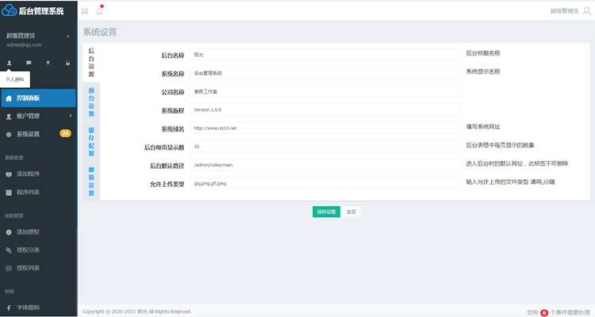

# ThinkPHP5.0后端框架
### 开发语言：PHP
### 开发工具：PhpStorm
## 网站简述：
整合ThinkPHP5.0+Layui+Nifty响应式后台管理模板，适用于中小企业快速搭建美观大方、简洁实用的后台应用。
## 使用说明：
1. 数据库配置：/application/database.php
2. 后台路径：http://域名/admin，账号：admin 密码：123456
## 网站截图：

